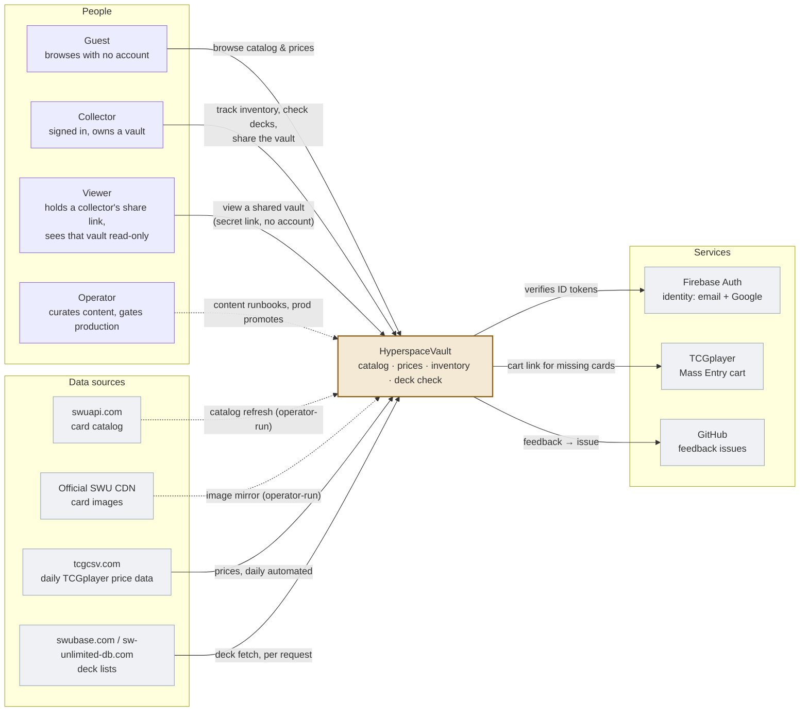
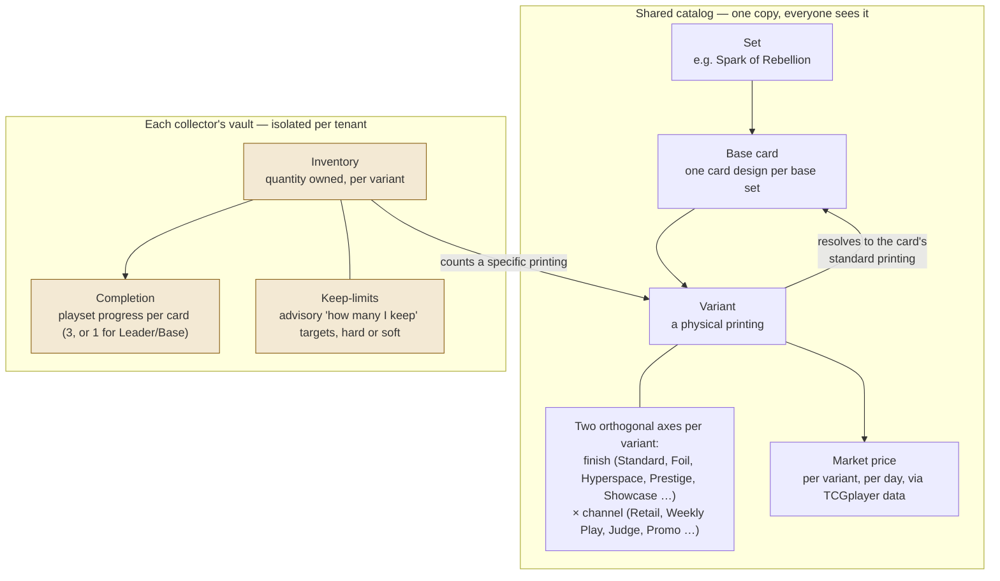

# What the system is, and for whom

*HyperspaceVault · Architecture · View 1 of 3 — Conceptual*

HyperspaceVault is a multi-tenant web application for Star Wars: Unlimited collectors. It carries the complete card catalog with daily market prices, and gives each signed-in collector a private, isolated vault to track what they own, what a deck would cost them, and what they're missing.

*Prepared 2026-07-28 · Updated 2026-08-16 (v1.4: collection sharing — the Viewer actor) · Companion views: [Logical](Architecture_Logical.md) (components & data) · [Physical](Architecture_Physical.md) (deployment & delivery)*

## System context

Three kinds of people touch the system, and it leans on a small set of outside services — one for identity, several as data sources, and one as an outbound hand-off when a collector wants to actually buy the cards they're missing.

**Context — actors and external systems**

Dashed lines are **operator-gated** flows — the card catalog and images only change when a human runs the content runbook. Solid inbound lines are automated or per-request. That split is deliberate: market prices move daily on their own, but the catalog is treated as curated content.

## The domain in one picture

Everything in the system divides into two worlds: a **shared catalog** — one copy, visible to everyone including guests — and **per-collector vault data**, isolated per tenant. The catalog's central idea is that one card design (a *base card*) exists as many physical *printings* (variants), and every variant resolves back to its card's standard printing so quantities and prices can roll up.

**Domain concept map**

**Card vs. variant vs. finish**
A base card is the design; variants are its printings. A variant's identity is described by two independent axes — visual finish and distribution channel — derived from the source data by one shared classifier, never stored redundantly.

**Standard-variant mapping**
Every printing walks its "variant of" chain to an ultimate root (chains up to two hops exist in the wild), landing on the card's Standard printing. The one genuine exception in the whole catalog is flagged, not blocked.

**Pricing, two ways**
*Standard* shows the standard printing's market price; *cheapest* shows the least money out the door — the lowest listed price across all of a card's printings. Every priced surface carries TCGplayer attribution and an as-of date; unpriced cards are excluded from sums with a visible count, never silently zeroed.

**Completion vs. keep-limits**
Deliberately decoupled: completion is variant-agnostic playset progress; keep-limits are each collector's own "how many do I keep" policy, enforceable as a hard block or a soft over-limit flag.

**Deck check**
Paste a deck (or a supported deck-site URL) and get a diff against your vault — what's missing, what it costs, and a pre-filled TCGplayer cart. Ephemeral by design: nothing is persisted.

## Who can do what

The catalog is an open storefront window — browsing requires nothing. Progressive trust gates the rest: an account, then a verified email for anything that mutates a vault, then a fresh re-authentication for the one irreversible action.

| Capability | Requires | Notes |
|---|---|---|
| Browse catalog, prices, images | `GUEST` | Public and CDN-cached; the growth funnel |
| View a shared vault | `SHARE LINK` | Secret link is the whole credential — read-only, revocable, rate-limited (v1.4) |
| Send feedback | `GUEST` | Rate-limited; lands as a GitHub issue |
| See own quantities on cards, deck check | `SIGNED IN` | First sign-in auto-provisions the vault |
| Add / remove cards, import / export | `SIGNED IN + VERIFIED EMAIL` | All vault mutations sit behind verification |
| Keep-limit settings | `SIGNED IN` | Per-tenant policy, hard or soft mode |
| Share the vault (view-only link) | `SIGNED IN` | One active link; rename, rotate, or revoke at will |
| Delete account | `SIGNED IN + RECENT RE-AUTH` | 5-minute freshness window; full tenant purge |
| Catalog refresh, image mirror, prod release | `OPERATOR` | Runbook-driven; production is always a human gate unless a release is explicitly low-risk |

## Principles that shape everything downstream

- **Catalog is curated, prices are automated.** Card data changes only through an operator-run runbook with verification steps; market prices refresh themselves daily.
- **Isolation lives in the database, not the application.** Tenant separation is enforced by Postgres row-level security — application bugs cannot leak one vault into another.
- **Guests are first-class.** The entire catalog experience works with no account, which sets the caching, cost, and abuse-control posture of the whole platform.
- **Honest numbers.** Prices always attributed and dated; missing data shown as missing, never as zero.
- **Production is a decision.** Every change reaches the dev environment automatically; reaching collectors requires an explicit owner action — or a release where every commit was pre-declared low-risk.

> **Where to go deeper:** the [Logical](Architecture_Logical.md) view maps these concepts onto components, APIs, and the data model; the [Physical](Architecture_Physical.md) view shows the cloud footprint and how a change travels from pull request to production.

---

*Prepared 2026-07-28, updated 2026-08-16 from the as-built system; companion views: [Logical](Architecture_Logical.md) · [Physical](Architecture_Physical.md)*
