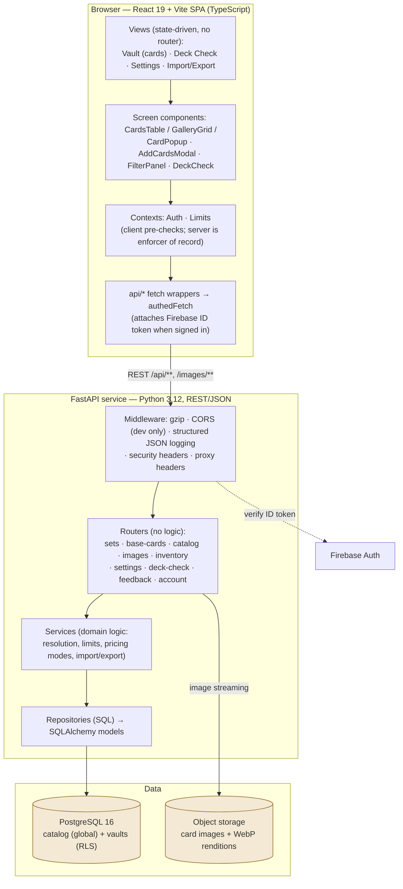
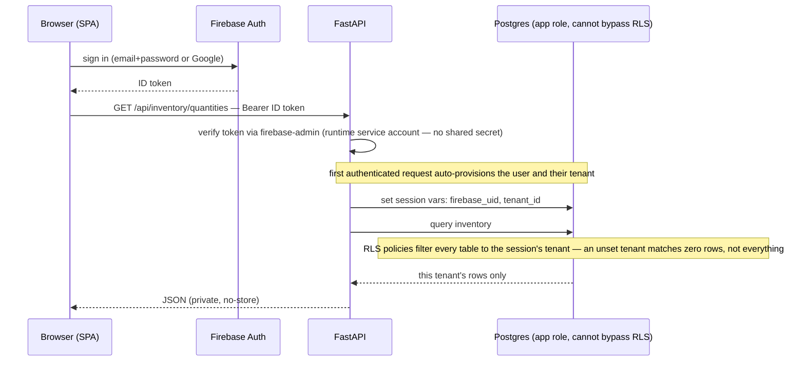
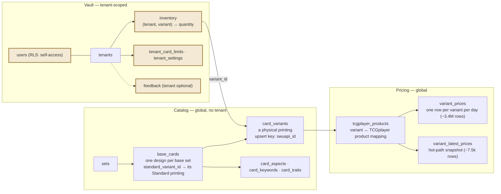
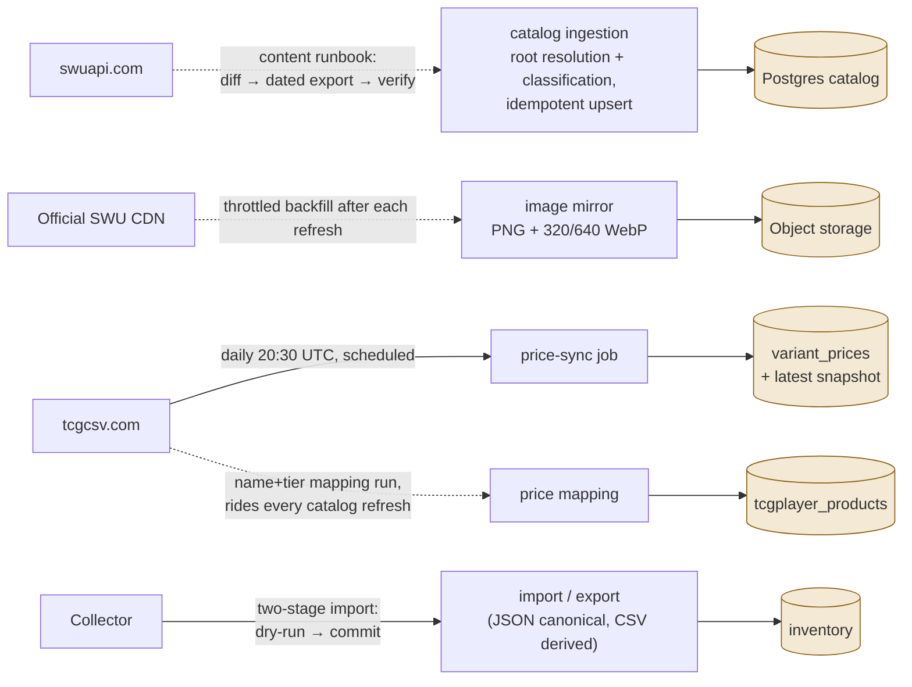

# Components, contracts, and the data model

*HyperspaceVault · Architecture · View 2 of 3 — Logical*

A React single-page app talks to one FastAPI service over REST; PostgreSQL holds both the shared catalog and per-tenant vaults, with tenant isolation enforced by the database itself. Around that core sit the ingestion pipelines that keep catalog, images, and prices current.

*Prepared 2026-07-28 · Companion views: [Conceptual](Architecture_Conceptual.md) (domain & actors) · [Physical](Architecture_Physical.md) (deployment & delivery)*

## Component layering

Both sides of the wire enforce a strict internal layering. The frontend keeps all server talk in thin fetch wrappers over one auth-aware client; the backend keeps routers free of logic, pushing it down through services to repositories.

**Logical components**

## API surface

| Route group | Purpose | Access |
|---|---|---|
| `/api/sets` | Set list and detail | `PUBLIC · CDN-CACHED` |
| `/api/base-cards` | Catalog list & card detail, price history; detail merges in your quantities when signed in | `PUBLIC` `(OPTIONAL AUTH)` |
| `/images/cards/*` | Card image streaming (3 renditions) | `PUBLIC · 1-YEAR IMMUTABLE CACHE` |
| `/api/catalog/reference.csv` | Resolution-key reference for importers | `PUBLIC` |
| `/api/inventory` | Quantities, increment / decrement, import / export | `AUTH · MUTATIONS + EXPORT NEED VERIFIED EMAIL` |
| `/api/deck-check` | Ephemeral three-scope deck diff with pricing | `AUTH` |
| `/api/settings/limits` | Keep-limit matrix, hard/soft cap mode | `AUTH` |
| `/api/feedback` | Feedback → GitHub issue (best-effort) | `OPTIONAL AUTH · RATE-LIMITED` |
| `/api/account` | Idempotent full-tenant delete | `AUTH + 5-MIN RECENT RE-AUTH` |

Auth requirements are expressed as a ladder of FastAPI dependencies — each endpoint declares exactly the trust level it needs: tenant-less catalog access, optional auth, required auth (which auto-provisions the user and tenant on first contact), verified email, and finally recent re-authentication for account deletion.

## Identity and tenant isolation

The load-bearing decision: **isolation is enforced by Postgres row-level security, not by application code**. Every request runs as a database role that cannot bypass RLS; the request's identity is injected as session variables, and policies do the filtering. A forgotten `WHERE tenant_id = …` in application SQL returns zero rows instead of another collector's vault.

**Authenticated request — token to tenant-scoped rows**

- **Two database roles by design:** a privileged role (may bypass RLS) used only by migrations and ingestion pipelines; an application role (cannot bypass RLS) used by every request. The session is pinned to one pooled connection for the request's life so the identity variables can't leak across requests.
- **Fail-closed policies:** the tenant-matching expression was hardened so a missing or cleared tenant matches *no* rows — there is no default-tenant fallback.
- **One user = one tenant**, auto-provisioned; the tenants table itself is scoped by server-derived filters (deletes only), everything tenant-owned is under forced RLS.

## Data model

Three clusters: the global catalog, global pricing keyed to catalog variants, and the tenant-scoped vault tables. Amber marks tables under **forced row-level security**.

**Core tables and relationships (medium detail)**

- **History vs. hot path:** daily prices append to a history table (866 days of depth for charts); a separate latest-price snapshot keeps list-view reads flat regardless of history size.
- **Idempotent catalog writes:** ingestion upserts on the source system's stable ID, so a re-run of the same export is a no-op — additive, single-transaction, safe to retry.
- **Variant classification is derived, not stored:** the raw source label is kept verbatim; finish and channel are computed on read by the same classifier ingestion uses — one source of truth, no denormalization drift.

## Data pipelines — automated vs. operator-gated

**Ingestion flows (dashed = operator-run)**

| Flow | Cadence | Trigger |
|---|---|---|
| Price sync (daily builds) | Daily, 20:30 UTC | `AUTOMATED` — scheduler |
| Catalog refresh + image backfill | Per new set / content change | `OPERATOR RUNBOOK` — verified end-to-end, prod gated |
| Price mapping | With every catalog refresh | `OPERATOR` — new printings never price without it |
| Price history backfill | One-time (complete) | `OPERATOR` — resumable archive walk, 3.4M rows |
| Inventory import / export | On demand | `COLLECTOR` — dry-run preview, then one-transaction commit |

> **Honest caveat baked into the design:** catalog *currency detection* is manual today — there is no automated "new set appeared" watcher. That is a documented operating decision (runbook-driven content), not an accident; automating detection is tracked backlog work.

---

*Prepared 2026-07-28 from the as-built system; companion views: [Conceptual](Architecture_Conceptual.md) · [Physical](Architecture_Physical.md)*
