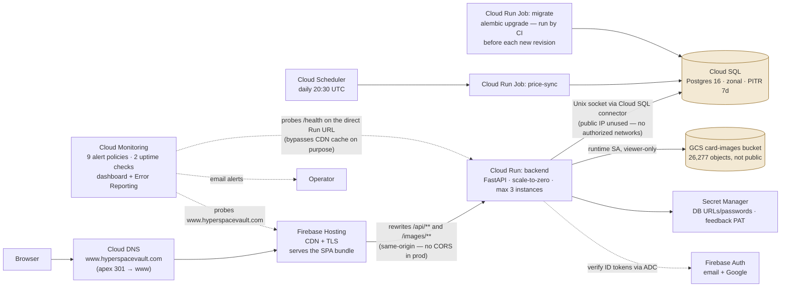
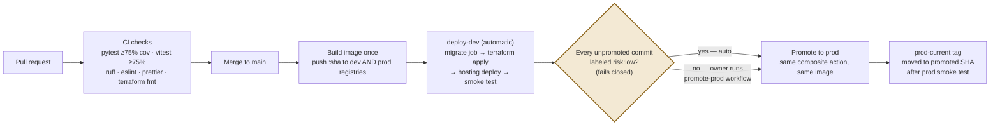

# Cloud footprint and the road to production

*HyperspaceVault · Architecture · View 3 of 3 — Physical*

Everything runs on Google Cloud in `us-central1`, in two mirrored environments defined by one shared Terraform module — a dev project and a prod project — plus a frozen sandbox for infra experiments. Firebase Hosting is the CDN and front door; there is deliberately no load balancer.

*Prepared 2026-07-28 · Companion views: [Conceptual](Architecture_Conceptual.md) (domain & actors) · [Logical](Architecture_Logical.md) (components & data)*

## Production runtime topology

**Prod (swu-prod) — request path and managed services**

The dev project (`swu-dev-jbapps`) is the same module with smaller knobs — one max instance, smaller database tier, no custom domain. A third project (`swu-sandbox`) exists only so infrastructure experiments never touch, or bill like, production.

| Edge caching | Policy | Why |
|---|---|---|
| Public catalog reads | `max-age=300, s-maxage=3600` | Guests hit the CDN, not the backend; ≤1h staleness accepted |
| Card images | `max-age=31536000, immutable` | Object paths are immutable by convention; cache forever |
| Tenant-scoped routes | `private, no-store` | Vault data must never land in a shared cache |

## From pull request to production

Delivery is **build-once, promote-many**: one Docker image is built per merge and pushed to both environments' registries; promotion re-deploys the exact bytes that dev validated. CI authenticates to Google Cloud with workload identity federation — no stored service-account keys anywhere. Database migrations run as a discrete job, to completion, *before* the new service revision takes traffic.

**CI/CD — GitHub Actions**

- **Human gate by default:** the pipeline ends at dev. Production is a deliberate `workflow_dispatch` with a SHA that must be an ancestor of main.
- **Risk-tiered fast lane:** auto-promotion fires only if *every* commit since the last promote carried a `risk:low` label — a whole-build guard that fails closed on any missing label, missing PR, or unreadable state.
- **`prod-current` is the source of truth** for "what is production running" — a tag moved only after the prod smoke test passes, readable without any cloud credentials.
- **Docs-only changes trigger zero workflow runs** — the pipeline's cost floor is guarded at the trigger level, with change detection as belt-and-braces.

## Environments at a glance

| | dev — swu-dev-jbapps | prod — swu-prod |
|---|---|---|
| Deploys | Automatic on merge to main | Owner-gated promote (or all-risk:low auto) |
| Front door | `swu-dev-jbapps.web.app` | `www.hyperspacevault.com` (apex 301; legacy domain still serving during soak) |
| Cloud Run max instances | 1 | 3 — bounds worst-case cost of flooding the anonymous catalog endpoints |
| Cloud SQL tier | db-f1-micro | db-g1-small committed; live instance upgrades on next promote |
| Deletion protection | Off | On |
| Alerting | 8 policies (doubles as a canary for alert config) | 9 policies — adds custom-domain uptime |

Local development mirrors the cloud shape with Docker Compose: Postgres 16, the backend (auto-migrating on start), the Vite dev server, and a Firebase Auth *emulator* — so a laptop needs **zero GCP credentials**, and row-level security is exercised identically in local, CI, and prod because the same migrations create the same restricted role everywhere.

## Cost and operations posture — chosen, not defaulted

- **Scale-to-zero everywhere**, bounded above (3 prod / 1 dev instances), with a $50/month billing budget alerting at 50/90/100%. The budget is deliberately managed outside Terraform so CI's cloud identity never holds billing permissions.
- **Uptime checks probe the direct backend URL, not the CDN** — a cached front door would happily serve hits long after the backend died. A second prod-only probe covers the real domain so DNS/TLS/Hosting failures aren't invisible either.
- **Zonal database, no HA** — accepted at current scale, with backups + 7-day point-in-time recovery. Stated RPO ≤ 1h / RTO ≤ 4h; the validating restore drill is tracked as open work, honestly not yet performed.
- **Rate limiting is in-memory per instance** (no WAF) — proportionate to current traffic; the instance cap is the backstop against abuse of the anonymous surface.

> **Known drift, stated on purpose** (an as-built diagram should say so): the prod database tier upgrade is merged but rides the next promote; Google sign-in is enabled in the console but not yet declared in Terraform; and the legacy domain remains live until the new domain's soak completes. All three are tracked backlog items, not surprises.

---

*Prepared 2026-07-28 from the as-built system; companion views: [Conceptual](Architecture_Conceptual.md) · [Logical](Architecture_Logical.md)*
